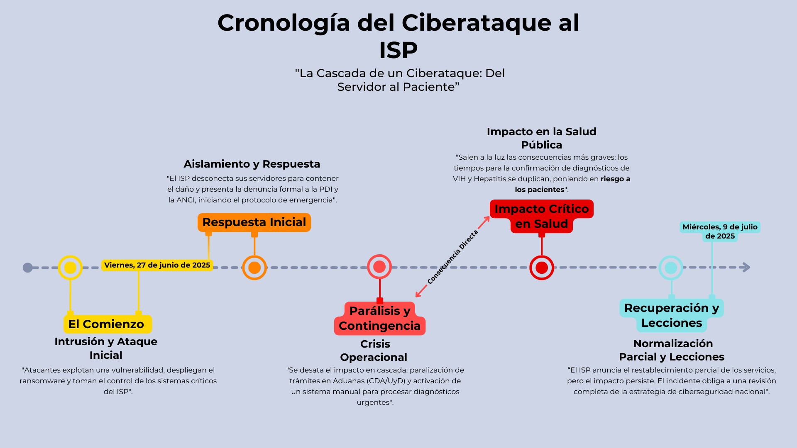

# Análisis del Ciberataque al Instituto de Salud Pública (ISP) de Chile

> Un caso de estudio sobre fallas en la gestión de riesgos y la resiliencia operacional, analizado bajo el marco NIST Cybersecurity Framework 2.0.

---

- **Autor:** Joan Franco Garcés Maldonado
- **Fecha:** Septiembre 2025
- **Perfil de LinkedIn:** [https://www.linkedin.com/in/joangarces/](https://www.linkedin.com/in/joangarces/)
- **Repositorio del Proyecto:** [https://github.com/bomdiaola/Analisis-ISP-NIST](https://github.com/bomdiaola/Analisis-ISP-NIST)

---

## Tabla de Contenidos

1.0 [Resumen Ejecutivo](#10-resumen-ejecutivo)

2.0 [Introducción y Contexto del Incidente](#20-introducción-y-contexto-del-incidente)

- 2.1 La Víctima: ¿Quién es el ISP y por qué es una infraestructura crítica?
- 2.2 El Incidente: Descripción de alto nivel del ataque de ransomware (Rhysida, 12 días de impacto).
- 2.3 El Adversario: Breve perfil del grupo Rhysida.

3.0 [Análisis de Impacto Operacional y de Negocio](#30-análisis-de-impacto-operacional-y-de-negocio)

- 3.1 Parálisis de la Industria Farmacéutica.
- 3.2 Riesgo de Filtración de Datos y Pérdida de Confianza.
- **Diagrama de Cronología (Timeline)**

4.0 [Análisis de Fallas bajo el Framework NIST CSF 2.0](#40-análisis-de-fallas-bajo-el-framework-nist-csf-20)

- 4.1 Gobernanza y Gestión de Riesgos (GV, ID).
- 4.2 Fallas en Controles Preventivos (PR).
  - **Diagrama de Arquitectura de Red (Simplificada)**.
- 4.3 Deficiencias en Detección y Respuesta (DE, RP).
  - **Diagrama de Cadena de Ataque (Cyber Kill Chain)** 
- 4.4 Incapacidad de Recuperación (RC).

5.0 [Recomendaciones Estratégicas y Tácticas](#50-recomendaciones-estratégicas-y-tácticas)
- 5.1 Mejoras en Gobernanza y Gestión de Riesgos.

6.0 [Conclusión](#60-conclusión)

7.0 [Referencias y Apéndices](#70-referencias-y-apéndices)

---

## 1.0 Resumen Ejecutivo

En junio de 2025, el Instituto de Salud Pública (ISP) de Chile fue víctima de un devastador ciberataque de ransomware que, más que un simple incidente técnico, expuso profundas vulnerabilidades estructurales en su postura de ciberseguridad. La parálisis operacional de 12 días desencadenó una severa crisis en cascada: comenzó con una parálisis logística que interrumpió la cadena de suministro farmacéutica nacional y escaló hasta convertirse en un grave riesgo para la salud pública, debido al inaceptable retraso en la confirmación de diagnósticos críticos como el VIH y la hepatitis. Un análisis bajo el marco NIST Cybersecurity Framework 2.0 diagnostica fallas sistémicas en todas las funciones, desde la Gobernanza (GV) hasta la Recuperación (RC). Este informe detalla dichas fallas y propone un plan de acción estratégico para reconstruir la resiliencia del ISP y asegurar que una crisis de esta magnitud no se repita.

---

## 2.0 Introducción y Contexto del Incidente

El presente análisis se centra en el ciberataque de ransomware que afectó al Instituto de Salud Pública (ISP) de Chile en junio de 2025. Este incidente no solo representa una falla técnica significativa, sino también un evento de seguridad nacional que paralizó una infraestructura crítica, exponiendo la fragilidad de sus sistemas y la profunda interconexión entre la ciberseguridad y la salud pública del país.

### 2.1 La Víctima: El Instituto de Salud Pública (ISP)

El Instituto de Salud Pública de Chile es la autoridad sanitaria y el referente técnico-científico del Estado encargado de proteger y promover la salud de la población. Su rol es insustituible, abarcando la vigilancia, fiscalización y autorización de productos farmacéuticos, cosméticos, dispositivos médicos y laboratorios.

Debido a su mandato, el ISP es custodio de un amplio espectro de datos altamente sensibles, cuya confidencialidad e integridad son vitales:

- Datos Industriales Críticos: Maneja la propiedad intelectual y las fórmulas de prácticamente todos los medicamentos y productos sanitarios que se comercializan en Chile a través de los registros sanitarios.

- Datos de Salud Pública Sensibles: Opera bases de datos cruciales para la vigilancia epidemiológica, incluyendo el registro nacional de confirmación de diagnósticos de VIH y hepatitis, información protegida por ley y de máxima sensibilidad para los pacientes.

La criticidad de su función convierte al ISP en un objetivo de alto valor para actores maliciosos, ya que una interrupción en sus operaciones no solo afecta a una entidad, sino a todo el ecosistema de salud y comercio del país.

### 2.2 El Incidente: Un Rehén Digital

El viernes 27 de junio de 2025, el ISP detectó una intrusión en sus sistemas que rápidamente se materializó en un ataque de ransomware a gran escala. Según informes, el ataque, cuyo origen se rastreó a una dirección IP en el Reino Unido, resultó en el cifrado y exfiltración de varios terabytes de información crítica.

Este acto dejó las bases de datos y sistemas clave de la institución en calidad de "rehén digital", interrumpiendo por completo sus operaciones y forzando a la entidad a desconectar sus servidores para contener el daño. El resultado fue una parálisis total de sus servicios en línea que se extendió por 12 días, generando un caos administrativo y una profunda incertidumbre a nivel nacional.

### 2.3 El Adversario: La Sombra de Rhysida

Aunque no ha habido una atribución oficial definitiva, las características del ataque y el contexto del panorama de amenazas sugieren que el responsable es el grupo de ransomware Rhysida. Este actor malicioso, activo desde 2023, es conocido por enfocarse en sectores "con fines de lucro" pero con un impacto social significativo, como la salud, la educación y el gobierno.

Las Tácticas, Técnicas y Procedimientos (TTPs) de Rhysida son consistentes con lo ocurrido en el ISP:

- Vector de Entrada: A menudo explotan vulnerabilidades en servicios de acceso remoto, como las redes privadas virtuales (VPN), especialmente aquellas sin una robusta autenticación multifactor (MFA).

  - Se presume que el vector de entrada fue un servicio de acceso remoto expuesto, como una VPN (T1133: External Remote Services), utilizando credenciales válidas pero comprometidas (T1078: Valid Accounts)

- Doble Extorsión: Su principal modus operandi es la doble extorsión. Antes de cifrar los archivos de la víctima, exfiltran (roban) una gran cantidad de datos sensibles. Posteriormente, amenazan con publicar o vender esta información en la dark web si no se paga el rescate, aumentando exponencialmente la presión sobre la organización afectada. Este método explica el "fantasma de la filtración de datos" que marcó la crisis del ISP.

- Herramientas y Técnicas: Utilizan una combinación de malware personalizado y herramientas legítimas de administración del sistema para moverse lateralmente dentro de las redes comprometidas, evadir detección y maximizar el daño.

## 3.0 Análisis de Impacto Operacional y de Negocio

La indisponibilidad de los sistemas del ISP durante 12 días no fue una simple interrupción técnica; fue un evento sistémico que desencadenó un efecto en cascada, paralizando procesos vitales para la economía y la salud de Chile. El impacto real del ataque se manifestó en dos grandes frentes: la cadena de suministro farmacéutica y, de forma más crítica, la atención directa de pacientes con patologías graves.

### 3.1 Parálisis de la Industria Farmacéutica y la Cadena de Suministro

Los sistemas del ISP, particularmente la plataforma GICONA, son el motor que permite el flujo de productos médicos y sanitarios a través de las fronteras chilenas. Con estos sistemas fuera de línea, la industria se enfrentó a un bloqueo logístico inmediato.

El principal punto de falla fue la incapacidad del ISP para emitir dos documentos cruciales para la gestión aduanera: el Certificado de Destinación Aduanera (CDA) y las autorizaciones de Uso y Disposición (UyD). Sin estos certificados, medicamentos, cosméticos, dispositivos médicos y otros productos sanitarios quedaron legalmente varados, sin poder ingresar formalmente al país.

Desde la Cámara de Innovación Farmacéutica (CIF) se alertó sobre las severas "dificultades operativas para las compañías, principalmente en lo relacionado con trámites regulatorios". Para evitar un colapso total en la cadena de suministro, el gobierno se vio forzado a implementar una medida de crisis: la liberación temporal de estos productos sin la documentación completa, utilizando una glosa especial en las declaraciones para un trazado posterior. Si bien esta acción mitigó el bloqueo inmediato, representó una solución improvisada que operaba al margen de los protocolos sanitarios estándar, evidenciando la fragilidad del sistema.

### 3.2 Riesgo Crítico para la Salud Pública: El Costo Humano del Ataque

Si bien el impacto comercial fue severo, la consecuencia más grave del ciberataque se manifestó en la salud directa de los pacientes. La dependencia del ISP para la confirmación de diagnósticos de alta sensibilidad se convirtió en el eslabón más débil de la cadena sanitaria nacional.

De acuerdo a la normativa chilena, los hospitales deben enviar muestras al ISP para la validación final de diagnósticos de VIH y Hepatitis B y C, un paso indispensable para iniciar los tratamientos cubiertos por las Garantías Explícitas en Salud (GES). Antes del ataque, este proceso tomaba entre 12 y 15 días. Tras el incidente, el ISP se vio obligado a recurrir a un sistema manual, lo que, según admitió la propia institución, provocó que los tiempos de espera se duplicaran, alcanzando los 30 días y rozando el límite legal de 45 días.

Este retraso no es inocuo. El Dr. Pablo Herrera, jefe del policlínico de Inmunología del Hospital Barros Luco, advirtió sobre las dramáticas consecuencias: "Estamos perdiendo ventanas de oportunidad de tratar oportunamente a la gente... Al no recibir el resultado, la persona se despreocupa y perdemos pacientes porque estos pacientes se vuelven a testear uno o dos años después en etapas mucho más avanzadas de la enfermedad". Esta declaración subraya el costo humano directo del ataque: la interrupción de la continuidad del cuidado y el riesgo de progresión de enfermedades graves por una falla de ciberseguridad.

### 3.2.1 La Contradicción: Impacto Real vs. Comunicación Oficial

Un punto crítico de este análisis es la discrepancia entre la comunicación oficial y la realidad vivida en los centros de salud. Mientras una de las primeras declaraciones aseguraba que el incidente "no compromete directamente la salud pública, sino la continuidad del comercio y logística nacional", la investigación de CIPER reveló una verdad muy distinta.

Al menos siete hospitales a lo largo de Chile, desde Arica hasta Temuco, reportaron formalmente los retrasos y sus graves implicancias. Esta contradicción expone una peligrosa desconexión entre la gestión de la crisis a nivel central y el impacto real en los pacientes. Demuestra una falla en la evaluación del alcance del incidente o un intento por minimizar un hecho que, como evidencia la declaración del Dr. Herrera, sí estaba comprometiendo la salud pública de manera directa y medible.

## Diagrama de Cronología (Timeline)

## 4.0 Análisis de Fallas bajo el Framework NIST CSF 2.0

El devastador impacto del ciberataque al ISP no fue un acto de mala suerte, sino el resultado predecible de un conjunto de fallas sistémicas en su estrategia, controles y procesos de ciberseguridad. Utilizando el NIST Cybersecurity Framework (CSF) 2.0 como herramienta de diagnóstico, es posible rastrear el origen de la crisis a deficiencias críticas en cada una de las funciones del ciclo de vida de la seguridad.

### 4.1 Gobernanza y Gestión de Riesgos (GV, ID): La Falla Estratégica

La raíz del incidente no se encuentra en una única vulnerabilidad técnica, sino en una falla a nivel de estrategia y supervisión.

- Función de Gobernanza (GV): Las declaraciones de expertos y autoridades pintan un cuadro claro de una gobernanza de ciberseguridad deficiente. Patricio Campos, CEO de Resility, lo define como un reflejo de "vulnerabilidades estructurales y de una débil continuidad de políticas públicas", mientras que el senador Iván Flores advierte sobre la "altísima precariedad de las protecciones", calificándola como una "cuestión estructural y política". Estas apreciaciones apuntan a una falla directa en la Gobernanza de Riesgos (GV.RM), donde la alta dirección del ISP probablemente no comprendió ni priorizó la ciberseguridad como un riesgo estratégico para la continuidad de sus operaciones y la salud pública de la nación.

- Función de Identificación (ID): La organización demostró un conocimiento inadecuado de sus propios activos y riesgos. El caos generado por la caída de la plataforma GICONA y los problemas de su sucesor, SAFIS, evidencia una pobre Gestión de Activos (ID.AM) y de los riesgos asociados a una migración tecnológica crítica. Más grave aún, la exposición y el retraso en la entrega de resultados de VIH demuestra que, si bien se sabía que los datos eran sensibles, el riesgo asociado a la indisponibilidad del sistema que los procesaba no fue correctamente evaluado (ID.RA). No se conectó la criticidad de los datos con la necesidad de proteger la infraestructura que los soportaba.

### 4.2 Fallas en Controles Preventivos (PR): Las Defensas Rotas

Los controles diseñados para detener un ataque antes de que cause daño fallaron de manera catastrófica.

- Protección de Datos (PR.DS): El "fantasma de la filtración" y el robo de "varios teras de información" son la prueba irrefutable de que los controles para prevenir la exfiltración de datos fueron ineficaces o inexistentes.

- Resiliencia de la Infraestructura (PR.IP): La lenta recuperación de 12 días implica directamente que las copias de seguridad (backups) no eran adecuadas. Para ser efectivas contra un ransomware, estas deben ser robustas, probadas y, crucialmente, estar aisladas (inmutables u offline) para evitar ser cifradas junto con los sistemas primarios.

- Control de Acceso y Segmentación (PR.AC): La necesidad de bajar todos los servidores para contener el ataque sugiere una pobre segmentación de red. Una red "plana" permite que un atacante, una vez dentro, se mueva lateralmente con facilidad y comprometa toda la infraestructura, en lugar de estar contenido en un solo segmento.

### Diagrama de Arquitectura de Red (Simplificada)

_"Nota: Este y los siguientes diagramas son una representación hipotética y simplificada de la arquitectura de red, basados en los hechos públicamente conocidos del incidente y en patrones comunes de vulnerabilidad. No representan la topología de red real del ISP, sino que sirven como una herramienta analítica para ilustrar las fallas de control preventivo y proponer una arquitectura más resiliente."_

### 4.3 Deficiencias en Detección y Respuesta (DE, RP): Oportunidades Perdidas

- Función de Detección (DE): Si bien no hay datos públicos sobre el "dwell time" (tiempo que el atacante estuvo dentro antes de ser detectado), un ataque de esta magnitud, que incluye la exfiltración de terabytes de datos, rara vez es instantáneo. Este hecho sugiere fuertemente que los sistemas de Monitoreo Continuo de Seguridad (DE.CM) no lograron generar ni alertar sobre la actividad anómala a tiempo.
- Función de Respuesta (RP): La respuesta del ISP tuvo luces y sombras. Por un lado, actuaron correctamente al seguir el protocolo inicial y contactar de inmediato a la ANCI y a la PDI (RP.CO). Sin embargo, la gestión de la crisis posterior fue deficiente. La Comunicación (RP.CO) con los stakeholders fue pobre, como lo confirma Jorge Cienfuegos al mencionar "la poca información que se le entrega a los usuarios". Además, las medidas como la "liberación temporal de productos" en Aduanas, aunque necesarias, fueron soluciones improvisadas que demuestran la falta de un plan de respuesta ensayado y robusto (RP.RP).

## Diagrama de Cadena de Ataque (Cyber Kill Chain)

_"Nota: Este diagrama ilustra las etapas típicas de un ataque de ransomware como el sufrido por el ISP, destacando las oportunidades perdidas para la detección y respuesta en cada fase. Está basado en el modelo de la Cyber Kill Chain desarrollado por Lockheed Martin."_
    
### 4.4 Incapacidad de Recuperación (RC): El Colapso de la Continuidad

La función de Recuperación es donde se evidenció el fracaso más visible y doloroso del ISP.

- Plan de Recuperación (RC.RP): La métrica principal del fracaso son los 12 días de parálisis total. Una infraestructura crítica nacional no puede permitirse un tiempo de inactividad de esta magnitud. El retorno a un "sistema manual" para procesar muestras de VIH es la evidencia más clara de que el plan de recuperación era inexistente o completamente inadecuado para un escenario de desastre como este.

- Mejoras (RC.IM): La propia admisión del ISP de que el sistema manual "implica demoras" no solo confirma la falla, sino que también establece la base para futuras mejoras. La lección más dura de este incidente es que la inversión en planes de recuperación y continuidad de negocio no es un gasto, sino una necesidad fundamental para garantizar la misión de la entidad.

## 5.0 Recomendaciones Estratégicas y Tácticas

El ciberataque al ISP no debe ser visto como una crisis contenida, sino como una advertencia fundamental para toda la infraestructura crítica del país. Superar las fallas diagnosticadas en este análisis requiere más que simples arreglos técnicos; exige un cambio cultural y una inversión estratégica en resiliencia. A continuación, se presentan recomendaciones clave, organizadas por áreas de impacto, para fortalecer la postura de ciberseguridad del ISP y prevenir la repetición de un incidente de esta magnitud.

### 5.1 Gobernanza y Estrategia: Abordar la Causa Raíz

La "altísima precariedad" mencionada en la investigación solo puede solucionarse con un compromiso desde el más alto nivel directivo y político.

- Elevar la Ciberseguridad a un Asunto Estratégico: La ciberseguridad debe dejar de ser considerada un gasto de TI para convertirse en un pilar de la gestión de riesgos de la organización, con supervisión directa del consejo directivo. Se debe establecer un comité de riesgos que evalúe y reporte periódicamente la postura de seguridad a la dirección.

- Plan de Inversión para Saldar la "Deuda Técnica": Es imperativo crear y financiar un plan plurianual para modernizar la infraestructura tecnológica heredada. El problemático caso de la transición de GICONA a SAFIS es un síntoma de una infraestructura frágil. Se debe realizar una auditoría completa de los sistemas críticos y priorizar la inversión para actualizarlos, asegurando que los nuevos sistemas se construyan sobre una base de seguridad desde el diseño.

- Evaluación y Gestión Continua de Riesgos: Implementar un programa formal de gestión de riesgos que incluya evaluaciones regulares, identificación de amenazas emergentes y ajustes proactivos en la estrategia de seguridad. Esto debe incluir la evaluación del riesgo asociado a la criticidad de los datos y sistemas, asegurando que los recursos se asignen adecuadamente para proteger los activos más valiosos.

### 5.2 Resiliencia Operacional y Controles Preventivos

Para sobrevivir a un ataque, la organización debe ser capaz de resistir el primer golpe y recuperarse rápidamente.

- Implementar un Plan de Continuidad de Negocio (BCP) y Recuperación de Desastres (DRP) Robusto: La parálisis de 12 días y el retorno a sistemas manuales son inaceptables. El ISP debe desarrollar e implementar un BCP/DRP que incluya:

  - Sistemas de Respaldo Fuera de Línea (Offline Backups): La recomendación más crítica. Se deben implementar copias de seguridad inmutables y aisladas de la red principal, siguiendo la regla 3-2-1 (tres copias, en dos medios distintos, con una fuera de línea). Estos respaldos deben ser probados regularmente para garantizar su integridad y la capacidad de restauración en un tiempo objetivo (RTO) aceptable para una entidad crítica.

  - Segmentación de Red: Implementar una arquitectura de red segmentada para contener la propagación de malware. Un ataque en un segmento no debería poder comprometer toda la infraestructura.

- Fortalecer el Perímetro y los Controles de Acceso:

  - Autenticación Multifactor (MFA) Obligatoria: Desplegar MFA en todos los accesos remotos (VPNs, escritorios remotos) y en las cuentas de administrador sin excepción. Este es el control más efectivo y de más bajo costo para prevenir el tipo de intrusión que probablemente sufrió el ISP.

  - Revisión y Minimización de Privilegios: Implementar el principio de menor privilegio en todas las cuentas y servicios, asegurando que los usuarios y sistemas solo tengan acceso a lo estrictamente necesario para sus funciones.

  - Gestión de Parches y Vulnerabilidades: Establecer un programa riguroso de gestión de parches para asegurar que todos los sistemas estén actualizados contra vulnerabilidades conocidas. Esto incluye la priorización de parches críticos y la verificación de su aplicación.

### 5.3 Respuesta y Comunicación de Crisis

La confianza pública se pierde o se gana en la forma en que una organización maneja una crisis.

- Desarrollar un Plan de Comunicación de Crisis Predefinido: El ISP debe crear un plan que establezca cómo, cuándo y a quién comunicar durante un incidente. Este plan debe incluir:

  - Matrices de Comunicación: Definir qué información se comparte con cada grupo de interés (público, industria farmacéutica, otros organismos del Estado, medios de comunicación).

  - Portavoces Designados y Mensajes Clave: Tener portavoces entrenados y mensajes pre-aprobados para evitar la desinformación y la incertidumbre, abordando directamente las preocupaciones de los afectados, como la falta de información sobre plazos que reclamaron los usuarios.

- Formalizar y Ensayar el Plan de Respuesta a Incidentes (IRP): Más allá de contactar a la ANCI, el ISP necesita un IRP interno que todo el equipo conozca. Este plan debe ser ensayado mediante simulacros de ciberataques (tabletop exercises) para asegurar que cada miembro del equipo sepa cuál es su rol y cómo actuar bajo presión.

### 5.4 Cultura Organizacional y Capacitación

La tecnología por sí sola no es suficiente; la gente es el eslabón más débil o el más fuerte en la cadena de seguridad.

- Programa de Concienciación y Capacitación Continua: Implementar un programa regular de formación en ciberseguridad para todos los empleados, adaptado a sus roles específicos. Esto debe incluir:

  - Simulaciones de Phishing: Realizar campañas periódicas para educar a los empleados sobre los riesgos del phishing y cómo identificar correos electrónicos maliciosos.

  - Formación en Buenas Prácticas de Seguridad: Instruir sobre la importancia de contraseñas seguras, el manejo adecuado de datos sensibles y la respuesta ante incidentes sospechosos.

- Fomentar una Cultura de Seguridad: Promover una cultura organizacional donde la ciberseguridad sea vista como una responsabilidad compartida. Esto puede incluir incentivos para reportar incidentes y reconocer buenas prácticas de seguridad.

## 6.0 Conclusión

El ciberataque de junio de 2025 al Instituto de Salud Pública no fue simplemente un incidente de seguridad; fue el catalizador que expuso una profunda y peligrosa precariedad en la infraestructura crítica de Chile. Este informe ha demostrado cómo vulnerabilidades estructurales y una gobernanza de riesgos deficiente permitieron que un solo punto de falla técnica desencadenara un impacto en cascada devastador, que comenzó con la parálisis de la industria farmacéutica y culminó en una emergencia de salud pública silenciosa: el retraso en la confirmación de diagnósticos de VIH.

A través del lente del NIST Cybersecurity Framework 2.0, se diagnosticaron fallas sistémicas que abarcan desde la estrategia hasta la recuperación. Por lo tanto, las recomendaciones propuestas no son un mero checklist técnico, sino un plan de acción para reconstruir la confianza y la resiliencia. La lección indeleble del caso ISP es que, en el siglo XXI, la ciberseguridad es salud pública. Proteger los datos es proteger vidas, y la inversión en resiliencia digital es una de las formas más críticas de salvaguardar el bienestar de una nación.

## 7.0 Referencias

Fuentes Periodísticas y Comunicados Oficiales

1. [Batarce, C. y Otárola, V. (2025, agosto 19). Hospitales fueron afectados por retrasos en entrega de resultados VIH y hepatitis tras el ciberataque al Instituto de Salud Pública. CIPER Chile.](https://www.ciperchile.cl/2025/08/19/hospitales-fueron-afectados-por-retrasos-en-entrega-de-resultados-vih-y-hepatitis-tras-el-ciberataque-al-instituto-de-salud-publica/)

2. [Camaño, D. (2025, julio 23). ISP de rehén: El hackeo que golpea la industria farmacéutica y el fantasma de la filtración de datos. Bío-Bío Chile Investiga.](https://www.biobiochile.cl/especial/bbcl-investiga/noticias/articulos/2025/07/23/isp-de-rehen-el-hackeo-que-golpea-la-industria-farmaceutica-y-el-fantasma-de-la-filtracion-de-datos.shtml)

3. [Carvajal, R. (2025, julio 10). Error 404: El hackeo que mantuvo en vilo por 12 días al Instituto de Salud Pública. La Tercera.](https://www.latercera.com/nacional/noticia/error-404-el-hackeo-que-mantuvo-en-vilo-por-12-dias-al-instituto-de-salud-publica/)

4. [Cut Security. (2025, agosto 25). Ciberataque al ISP: Lecciones Clave para Proteger Infraestructura Crítica en tu Empresa. Cut Security Blog.](https://cutsecurity.cl/blog/ciberataque-isp/)

5. [Instituto de Salud Pública de Chile. (2025, julio 9). Avances en normalización de los sistemas del ISP. Gob.cl.](https://www.ispch.gob.cl/noticia/avances-normalizacion-de-los-sistemas-del-isp/)

6. [Radio Universo. (2025, julio 2). Asilfa acusa falta de información por parte de la autoridad sanitaria tras hackeo al ISP. Universo.cl.](https://universo.cl/actualidad/asilfa-acusa-falta-de-informacion-por-parte-de-la-autoridad-sanitaria-tras-hackeo-al-isp-2/)

Frameworks y Reportes de Inteligencia de Amenazas

1. [National Institute of Standards and Technology (NIST). (2024, febrero 26). The NIST Cybersecurity Framework (CSF) 2.0. NIST.](https://www.nist.gov/cyberframework)

2. [MITRE Corporation. (2024). MITRE ATT&CK®. Consultado en septiembre de 2025.](https://attack.mitre.org/)

3. [Trend Micro. (2024, febrero 21). Ransomware Spotlight: Rhysida. Trend Micro Research.](https://www.trendmicro.com/vinfo/us/security/news/ransomware-spotlight/ransomware-spotlight-rhysida)

4. [Cybersecurity and Infrastructure Security Agency (CISA). (2023, noviembre 14). #StopRansomware: Rhysida Ransomware. CISA Advisory AA23-319A.](https://www.cisa.gov/news-events/cybersecurity-advisories/aa23-319a)

5. [Lockheed Martin. (s.f.). Cyber Kill Chain®. Consultado en septiembre de 2025.](https://www.lockheedmartin.com/en-us/capabilities/cyber/cyber-kill-chain.html)